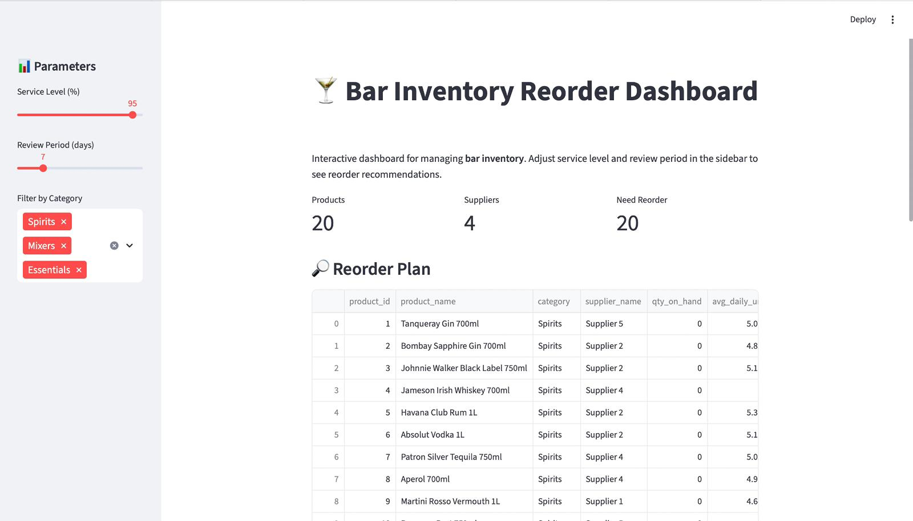
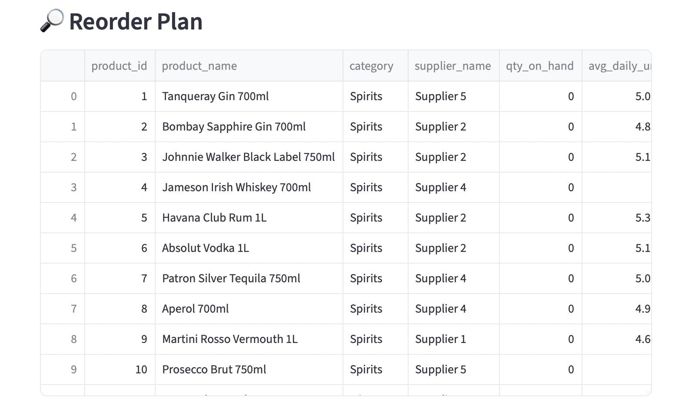
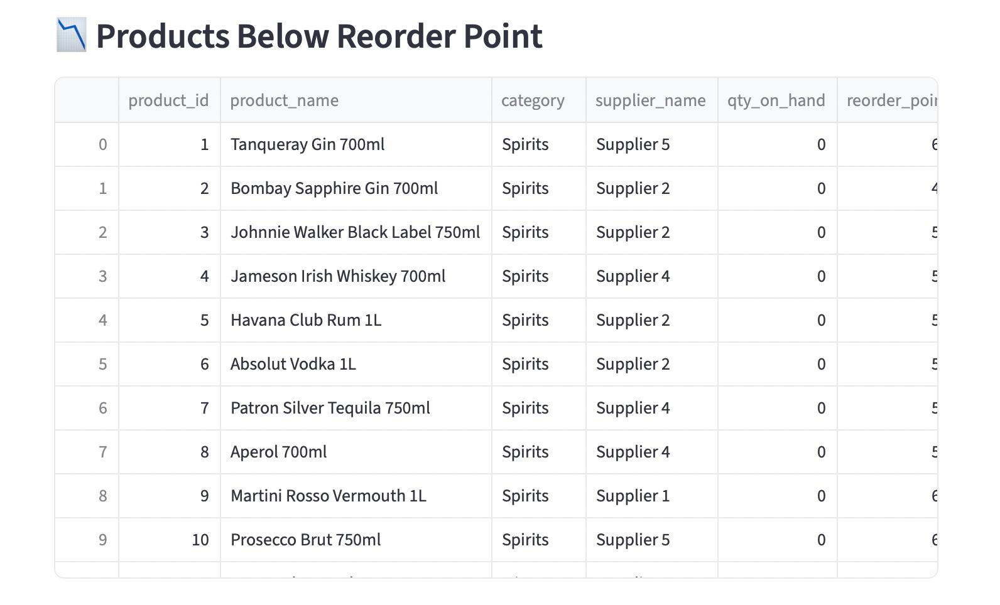
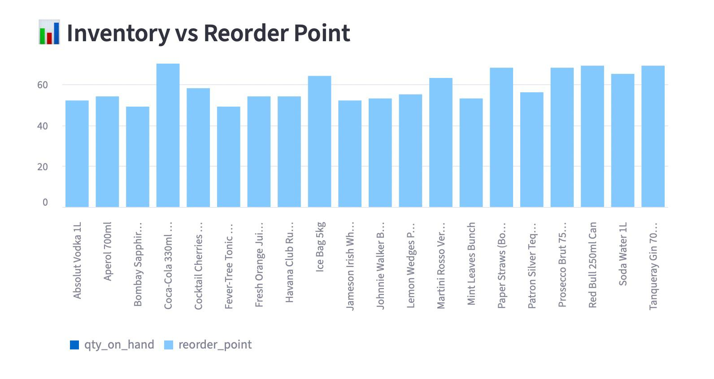

# 🍸 Bar Inventory Analytics Dashboard

An end-to-end **data analytics project** simulating a **bar inventory management system**.  
It demonstrates **ETL pipelines, SQL analytics, and an interactive Streamlit dashboard** for reorder planning and supplier performance.

---

## 🔹 Features
- **Synthetic Data Generator (Python ETL)**  
  - Creates realistic bar inventory (Spirits, Mixers, Essentials)  
  - Generates 90 days of sales, purchase orders, and stock levels  

- **MySQL Database**  
  - Stores suppliers, products, sales, and inventory snapshots  
  - Includes SQL views for average daily demand, reorder candidates, supplier reliability  

- **Analytics Layer (Python)**  
  - Calculates safety stock, reorder points, and suggested order quantities  
  - Outputs reorder plans to CSV  

- **Streamlit Dashboard**  
  - Interactive KPIs, tables, and charts  
  - Category filter (Spirits, Mixers, Essentials)  
  - Download reorder plan as CSV  

---

## 📊 Dashboard Preview

### Main KPIs + Filters


### Reorder Plan Table


### Products Below Reorder Point


### Inventory vs Reorder Point


---

## 🚀 Tech Stack
- **Python** (Pandas, NumPy, SciPy, SQLAlchemy)  
- **MySQL** (data storage + SQL views)  
- **Streamlit** (interactive dashboard)  

---

## 🛠️ How to Run

```bash
# Clone repo
git clone https://github.com/BasementFox069/bar-inventory-analytics.git
cd bar-inventory-analytics

# Create virtual environment
python -m venv .venv
source .venv/bin/activate   # Mac/Linux
.venv\Scripts\activate      # Windows

# Install dependencies
pip install -r requirements.txt

# Generate synthetic data
python -m etl.generate_data

# Load into MySQL
python etl/load_to_mysql.py

# Run analytics
python analytics/reorder_plan.py

# Launch dashboard
streamlit run app/streamlit_app.py
